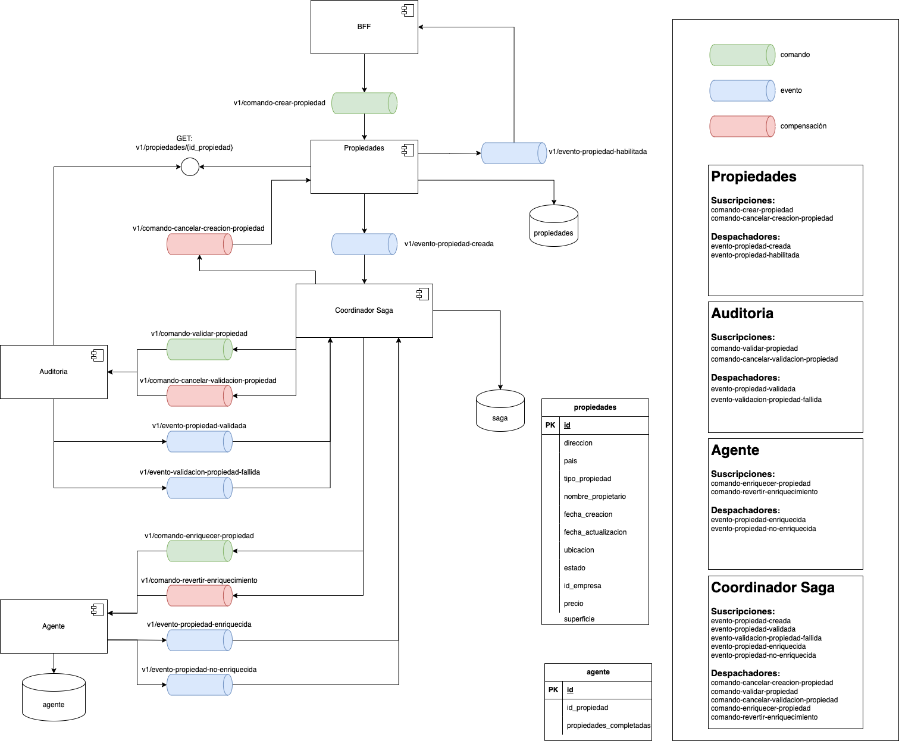

Equipo

Diagrama



# Propiedades de los Alpes

Para la ejecucion de este repositorio , puede probarlo por medio de gitpod, instalando la extension de chrome Gitpod


<a href="https://chromewebstore.google.com/detail/gitpod/dodmmooeoklaejobgleioelladacbeki?hl=es"> GitpodChrome</a>


Y en el mismo repo debe aparecer la opcion para la redireccion de gitpod


### Ejecutar Aplicación

Ahora para probar el POC primero se procede levantando el pulsar

### Correr docker-compose usando profiles

Correr Servicio de Base de datos
```bash
docker-compose --profile postgresPropiedades up
```

Correr Servicio Pulsar
```bash
docker-compose --profile pulsar up
```


Luego se procede a ejecutar la aplicación

Desde el directorio principal ejecute el siguiente comando.

```bash
flask --app src/propiedadDeLosAlpes/api run
```

Siempre puede ejecutarlo en modo DEBUG:

```bash
flask --app src/propiedadDeLosAlpes/api --debug run
```

BFF: Web

Desde el directorio src ejecute el siguiente comando

```bash
uvicorn bff_web.main:app --host localhost --port 8003 --reload
```

```sql
select * from propiedades;
select * from agentes;

-- delete from propiedades;
-- delete from agentes;
```

```json
{
"nombre_propietario": "Camilo",
"direccion": "",
"pais": "",
"tipo_propiedad": "Apartamento",
"ubicacion": "Torres del Bosque",
"id_empresa": 12345,
"superficie": 80.5,
"precio": 230000000
}
```

## Contribuciones

Dentro de las contribuciones se dividio el grupo en dos. Esto es debido a que se habian ya utilizado el tiempo limite de gipod, por ende se hizo un trabajo entre pares, desarrollando el codigo desde la cuenta de Benito y David

### David y isai 
> Implementacion de sagas y BFF
### Benito y Camilo
> Implementacion de la comunicacion mediante eventos , comandos y mensajes

### Postman collection 

Obtener información de propiedad por ID

[postman](https://github.com/CBarreiro22/pruebaMonoliticas/blob/main/GET%20propiedad.postman_collection.json)

### graphql

para registrear la propiedad

[proyecto compartido de postman](https://speeding-rocket-833109.postman.co/workspace/New-Team-Workspace~a2fd0a9f-43b7-45f5-93b1-c063c924a2b8/collection/65ee4e13fd7b469b2c45ea09?action=share&creator=23921893)

esto tiene que estar corriendo
[version web](https://8003-cbarreiro22-pruebamonol-g3xl65m8gaa.ws-us108.gitpod.io/v1)

monitorea registros exitosos

[registros exitosos](https://8003-cbarreiro22-pruebamonol-g3xl65m8gaa.ws-us108.gitpod.io/stream)

monitorear registros no exitodos
[registros no exitosos](https://8003-cbarreiro22-pruebamonol-g3xl65m8gaa.ws-us108.gitpod.io/stream/evento/validacion/propiedad/fallida)

Las url deben ser reemplazadas con la nueva ejecución.
